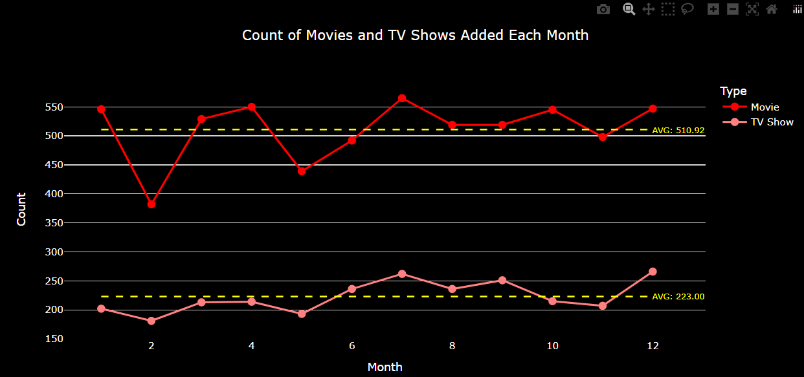
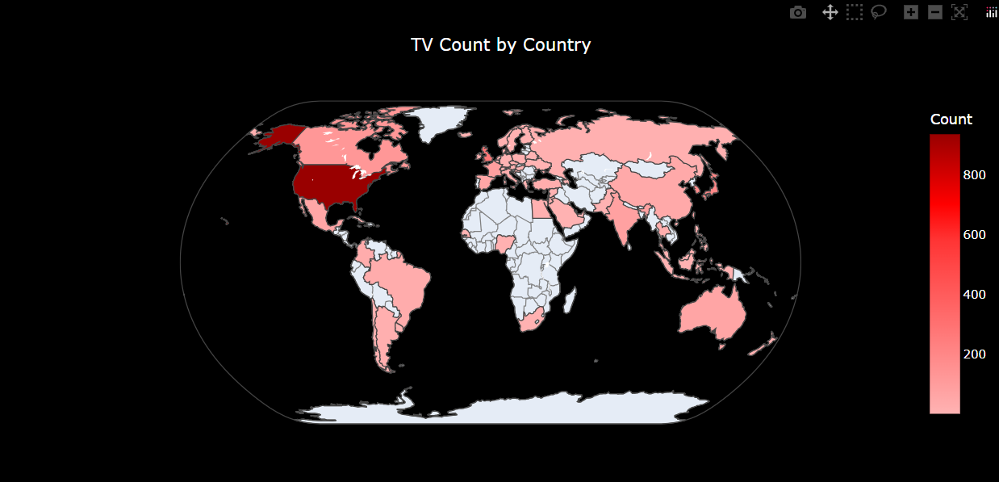
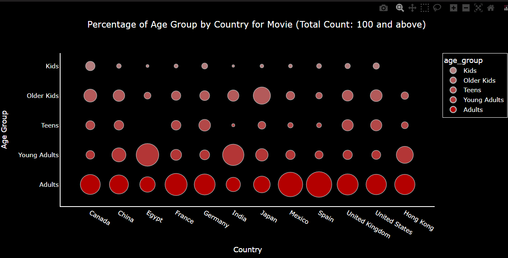

# Netflix Movies and TV Shows

This project involves analyzing a dataset containing information about TV shows and movies available on Netflix.
To enhance the analysis, I utilize Plotly for creating interactive visualizations and argparse for handling command-line parameters, making it easy to generate specific charts based on user input.

## Dataset

- **Link to dataset:** [Netflix Movies and TV Shows on Kaggle](https://www.kaggle.com/datasets/shivamb/netflix-shows)
- **Description:** The dataset contains 8807 rows and 12 columns.

### Columns

- `show_id`: Unique identifier for each show.
- `type`: Type of content (Movie or TV Show).
- `title`: Title of the show.
- `director`: Director(s) of the show.
- `cast`: Actors starring in the show.
- `country`: Country where the show was produced.
- `date_added`: Date when the show was added to Netflix.
- `release_year`: Year when the show was released.
- `rating`: Content rating of the show.
- `duration`: Duration of the show (in minutes for movies, in seasons for TV shows).
- `listed_in`: Genres the show is listed under.
- `description`: Brief description or synopsis of the show.

## Exploratory Data Analysis (EDA)

### Link to Colab Notebook

- **Colab Notebook:** [Netflix EDA Notebook](https://colab.research.google.com/drive/1ys8Alf2s3ERY8bW8DDly6_wOfeJdTOH1?usp=sharing)

## Visualizations

### 1. Top N Bar Chart

A bar chart that dynamically displays the top N directors or actors based on parameters, the default N parameter is 5. 

##### Chart Example
To generate this visualization, you can run the following command:
```bash
python main.py -col cast
```


### 2. Amount Over Time Line Chart
A line chart that displays the Count of Movies and TV Shows Added Over Time, illustrating the trend in content additions to Netflix categorized by year or month parameter. Additionally, it highlights the average count values for both movies and TV shows.

##### Chart Example
To generate this visualization, you can run the following command:
```bash
python main.py -i month
```


### 3. Distribution by Country Map Chart
A world map chart that visualizes the distribution of content counts across different countries. The coloring intensity on the map represents the count of content entries in each country. 

##### Chart Example
To generate this visualization, you can run the following command:
```bash
python main.py -tp TV
```


### 4. Percentage of Age Group by Country Scatter Chart
A scatter plot that visualizes the percentage of each age group of rating within each country, filtered by a specified total count threshold, the default threshold parameter is 100. 

##### Chart Example
To generate this visualization, you can run the following command:
```bash
python main.py -tp Movie -r
```

